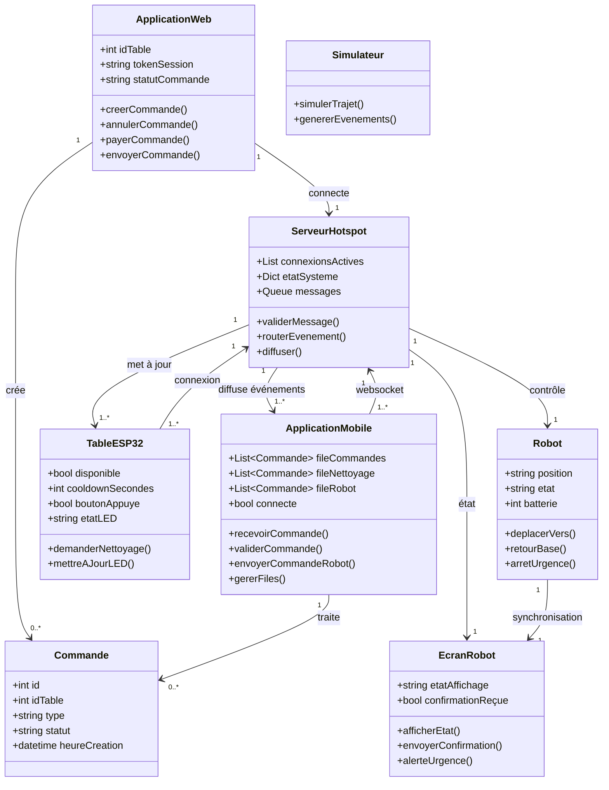
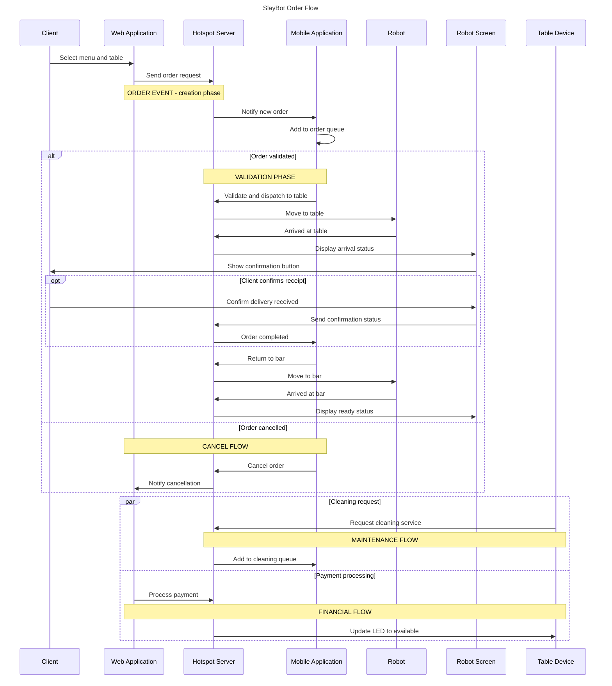
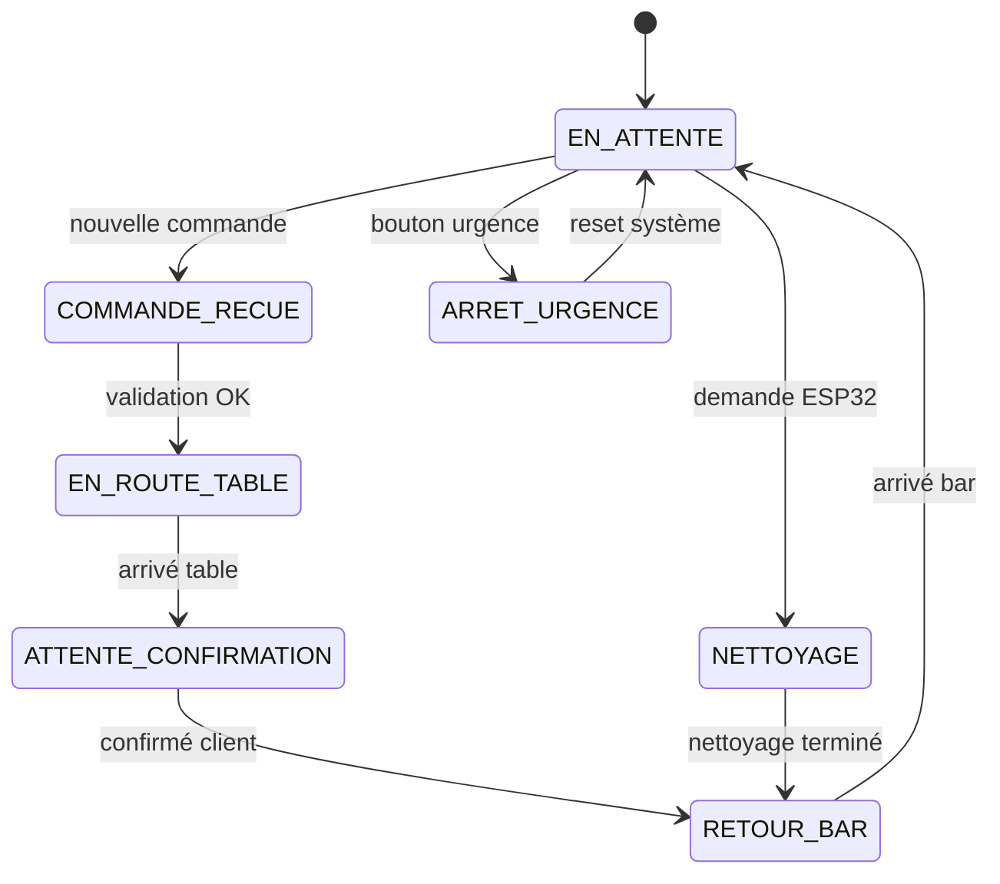

# Architecture générale de SlayBot

SlayBot est un système modulaire de robot de service conçu pour les restaurants. Chaque composant remplit un rôle spécifique et communique en temps réel via WebSocket.

## UML

### Diagramme de SÉQUENCE

### Diagramme d'État

## Modules principaux

### 1. `site_commande` (Application web)

**Responsabilité** : Gestion des commandes clients et dashboard restaurateur.

**Technologie** : Flask + SocketIO + PostgreSQL

**Fonctionnalités** :

* Interface client pour sélectionner une table et un menu.
* Dashboard restaurateur pour valider/annuler/payer les commandes.
* Gestion automatique des tokens de table.
* Connexion WebSocket au hotspot pour l'envoi des ordres.

**Les points clés** :

* Un token = une session de table.
* Les ordres sont validés par le restaurateur avant transmission au robot.
* Le paiement libère la table et invalide tous ses tokens.

---

### 2. `slaybot_apk` (Application Android)

**Responsabilité** : Réception des ordres et gestion de la file d'attente robot.

**Technologie** : Kivy + WebSocket client

**Fonctionnalités** :

* Affichage des commandes reçues du hotspot.
* Gestion de trois files : ordres, nettoyage, file robot.
* Envoi des commandes au hotspot pour exécution.
* Statut visuel : connexion, occupation, complétion.

**Les points clés** :

* L'APK ne décide pas ; elle transmet les ordres validés par le restaurateur.
* La file robot est gérée localement par l'APK.
* Reconnexion automatique en cas de perte de connexion.

---

### 3. `slaybot_hotspot` (Serveur central)

**Responsabilité** : Relais central et dispatcher des commandes.

**Technologie** : Python asyncio + WebSockets

**Fonctionnalités** :

* Serveur WebSocket sur `0.0.0.0:8765`.
* Diffusion des messages à tous les clients connectés.
* Traitement des commandes métier (order, clean, cancel, paid).
* Gestion du hotspot Wi-Fi local (10.42.0.1).

**Les points clés** :

* Le hotspot est le point unique de convergence.
* Tous les messages sont relayés à tous les clients.
* Aucune logique métier (juste du relais d'événements).

---

### 4. `slaybot_screen` (Interface robot)

**Responsabilité** : Affichage visuel embarqué du robot.

**Technologie** : Tkinter + WebSocket client

**Fonctionnalités** :

* Visage animé selon l'état du robot.
* Confirmation de livraison (bouton visible à table).
* Arrêt d'urgence disponible en permanence.
* Reconnexion automatique.

**Les points clés** :

* L'écran suit passivement l'état du robot.
* Il ne prend aucune décision métier (juste de l'affichage).
* Les interactions (confirmation, urgence) sont envoyées au hotspot.

---

### 5. `slaybot_table` (Table ESP32)

**Responsabilité** : Point de demande de service côté table.

**Technologie** : MicroPython + WebSocket client

**Fonctionnalités** :

* Bouton de demande de service (nettoyage).
* LEDs pour indiquer l'état (vert = disponible, jaune = en cours).
* Connexion automatique au hotspot.
* Cooldown après chaque service.

**Les points clés** :

* Très simple : une entrée (bouton), une sortie (LEDs).
* Le cooldown empêche les appels répétés.
* Redémarrage automatique en cas de perte réseau.

---

### 6. `slaybot_utilitaire_dev` (Simulateur)

**Responsabilité** : Test et développement sans matériel réel.

**Technologie** : Qt + WebSocket server

**Fonctionnalités** :

* Simulation visuelle du trajet du robot.
* Serveur WebSocket local pour tester les flux.
* Visualisation de la file d'attente.

**Les points clés** :

* Utilise les mêmes protocoles WebSocket que le reste du système

* Permet de valider les flux sans Raspberry Pi ou hardware réel.

---

## Flux de communication complet

### Scénario : Une commande de la table à la livraison

1. **Client (web)** : Sélectionne un menu et envoie la commande.
2. **Dashboard** : Le restaurateur valide la commande.
3. **site_commande** → **hotspot** : Envoie `order/table/2`.
4. **hotspot** → **APK** : Notifie la réception de la commande.
5. **APK** : Affiche la commande dans la file et la valide.
6. **APK** → **hotspot** : Envoie `go/2` ("aller à la table 2").
7. **hotspot** → **screen** : Notifie le déplacement.
8. **screen** : Affiche "EN ROUTE vers Table 2".
9. **Robot arrive à la table 2**.
10. **hotspot** → **screen** : Envoie `arrived/table/2`.
11. **screen** : Affiche bouton de confirmation vert.
12. **Client de la table** : Appuie sur "J'ai reçu".
13. **screen** → **hotspot** : Envoie `status/received`.
14. **hotspot** → **APK** : Confirmé.
15. **APK** → **hotspot** : Envoie `go/bar` (retour à la base).
16. **Robot revient au bar**.
17. **hotspot** → **screen** : Envoie `arrived/bar`.
18. **screen** : Affiche "PRÊT".

---

## Protocole WebSocket

### Messages standards
| Message                | Origine        | Destination    | Sens           |
|------------------------|----------------|----------------|----------------|
| `order/table/X`        | Web/Dashboard  | Hotspot/APK    | Commander      |
| `clean/table/X`        | Table ESP32    | Hotspot/APK    | Nettoyer       |
| `go/X`                 | APK            | Hotspot        | Se déplacer    |
| `paid/table/X`         | Dashboard      | Hotspot        | Paiement       |
| `cancel/table/X`       | Dashboard      | Hotspot        | Annuler        |
| `arrived/table/X`      | Robot          | Hotspot/Screen | Arrivée à table|
| `arrived/bar`          | Robot          | Hotspot/Screen | Retour bar     |
| `status/received`      | Screen         | Hotspot        | Confirmation   |
| `status/emergency_stop`| Screen         | Hotspot        | Urgence        |

## Objectifs de conception

* **Une seule commande active par table** : Pas de surcharge.
* **Tokens de session** : Sécurité et suivi des sessions.
* **Paiement verrouillé côté restaurateur** : Contrôle financier central.
* **Relais passif du hotspot** : Découplage des modules.
* **Protocole WebSocket simple** : Extensibilité et maintenance.
* **Documentation autonome** : Compréhension sans lecture du code.

---

## Notes de sécurité

Le système SlayBot repose sur un hotspot Wi-Fi local (10.42.0.1) et un serveur WebSocket (0.0.0.0:8765). Pour éviter les accès non autorisés :

* Modifiez le mot de passe par défaut du hotspot.
* Ne publiez jamais le port 8765 sur un réseau public sans protection supplémentaire.
* Utilisez TLS/SSL pour les connexions sensibles en environnement de production.
* Validez toutes les commandes côté serveur (hotspot).
* Implémentez des mécanismes d'authentification pour les clients critiques.

Consultez [SECURITY.md](https://github.com/ismael-belghazi/Slaybot/blob/main/SECURITY.md) pour la politique de sécurité complète.
